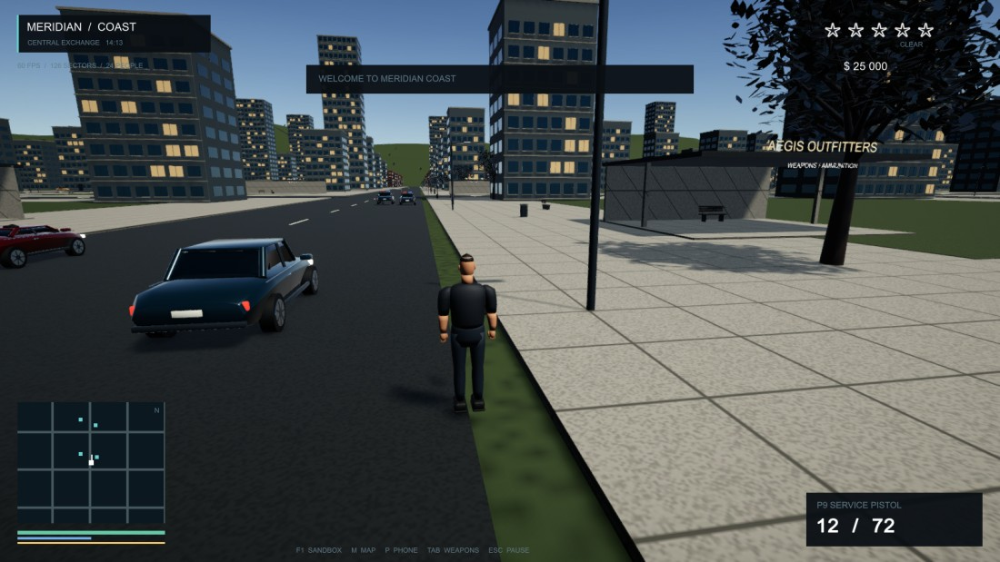

# Meridian Coast — Unity GTA

**Скачать и играть: [Windows](https://github.com/Prokopiy8247/GTA-Unity-Godot-Unreal-Blender/releases/download/unity-v1.0.0/Meridian-Coast-Windows-x64.zip) · [macOS — Intel и Apple Silicon](https://github.com/Prokopiy8247/GTA-Unity-Godot-Unreal-Blender/releases/download/unity-v1.0.0/Meridian-Coast-macOS-Universal.zip)**

Unity, Blender, Git и инструменты программирования для запуска готовой игры не нужны.

## Запуск за минуту

**Windows:** скачайте Windows-архив → нажмите правой кнопкой «Извлечь всё» → откройте извлечённую папку → дважды нажмите **PLAY.cmd** или **MeridianCoast.exe**. Не переносите EXE отдельно от остальных файлов.

**Mac:** скачайте macOS-архив → дважды нажмите ZIP для распаковки → перетащите **Meridian Coast.app** в «Программы» → откройте приложение. Если macOS попросит разрешение для неизвестного разработчика, порядок действий описан в [гайде](Docs/PLAY_RU.md#macos). Это независимая сборка без Developer ID и нотариализации Apple.

**F11** переключает полный экран. На некоторых Mac требуется **Fn + F11**. **F1** открывает меню песочницы: автомобили, оружие, районы, погода и полиция.

[Подробный гайд для Windows и Mac](Docs/PLAY_RU.md) · [Возможности и ограничения](FEATURE_MATRIX.md) · [Исходный промпт](GPT-6-Astra_Unity_GTA_BlenderMCP_Prompt.md)

## Что это за игра

Оригинальный одиночный прототип свободной игры без миссий: карта 6 × 6 км, 15 видов транспорта, пешеходы и трафик, оружие, полиция и розыск 0–5, магазины, сохранения, погода и смена суток. Созданы 54 Blender-модели и 11 LOD. Графика, анимации, AI и наполненность мира остаются упрощёнными; это не готовая AAA-игра.

## Управление

| Клавиши | Действие |
|---|---|
| WASD / мышь | Движение, управление транспортом / камера |
| Shift / Space | Бег / прыжок; парашют при падении |
| F / E | Войти или выйти из транспорта / взаимодействовать |
| ЛКМ / ПКМ / R | Стрелять / прицелиться / перезарядить |
| Колесо / Tab | Выбрать оружие / показать арсенал |
| M / P / Esc | Карта / телефон / пауза |
| F1 / F11 | Меню песочницы / полный экран |
| F5 / F9 | Сохранить / загрузить |

## Для разработчиков

Unity **6000.6.0f1**, URP **17.6.0**, C#. В Unity Hub добавьте именно папку `Unity GTA`, откройте `Assets/GTA/Scenes/Meridian_FreeRoam.unity` и нажмите Play. Сцена собирает мир автоматически. Импортированные модели и префабы уже включены; Blender для запуска проекта не требуется.

Сборка: `Meridian > Release > Build Windows` или `Build macOS Universal`. Также доступны `Build Meridian Coast.ps1` и `Build Meridian Coast.command`. Для нужной платформы установите её Build Support через Unity Hub. Blender-исходник — `UnityGTA.blend`; экспортные скрипты берут путь относительно него.

[Архитектура и все клавиши](DEVELOPMENT.md) · [Исторический отчёт разработки](ASTRA_FINAL_REPORT.md) · [Подготовка публичной версии](PUBLICATION.md)
