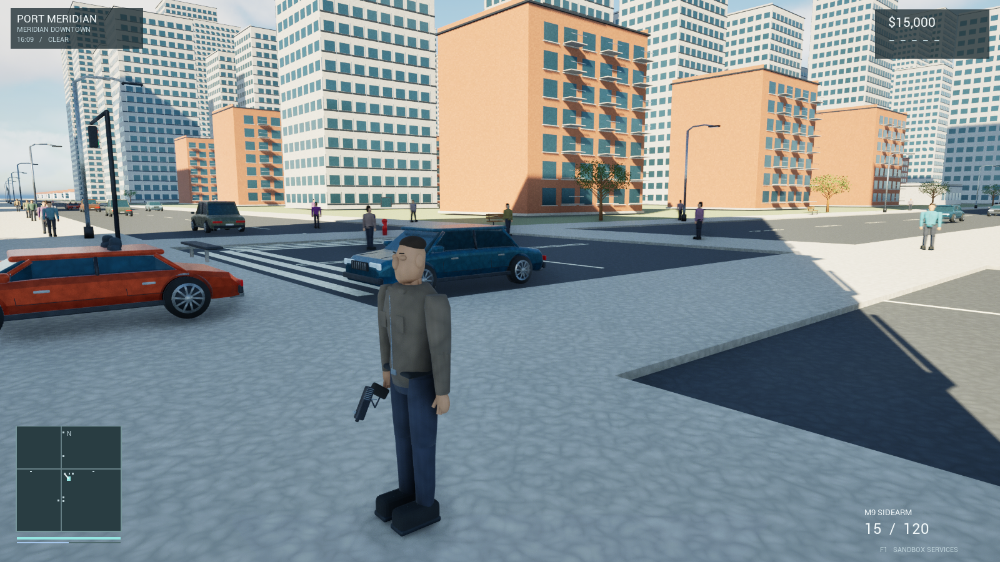
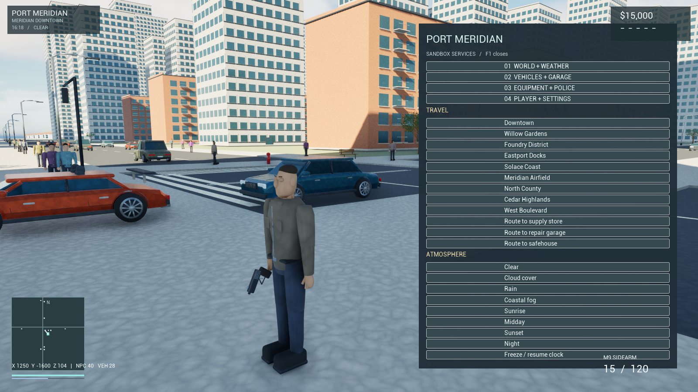
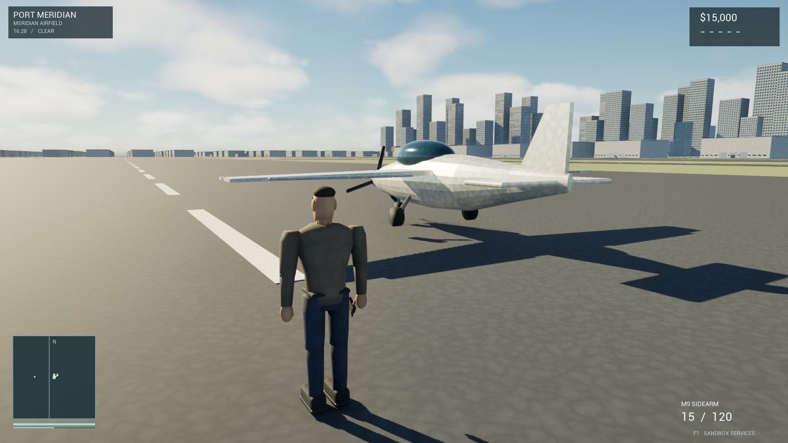
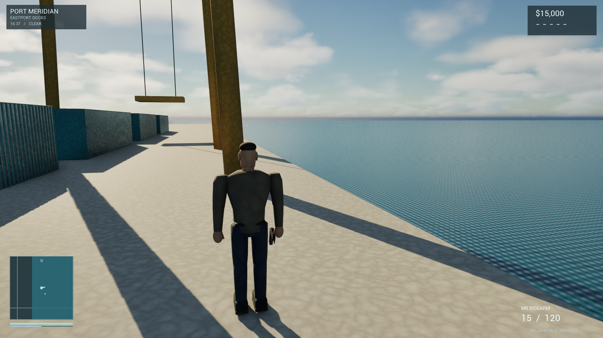
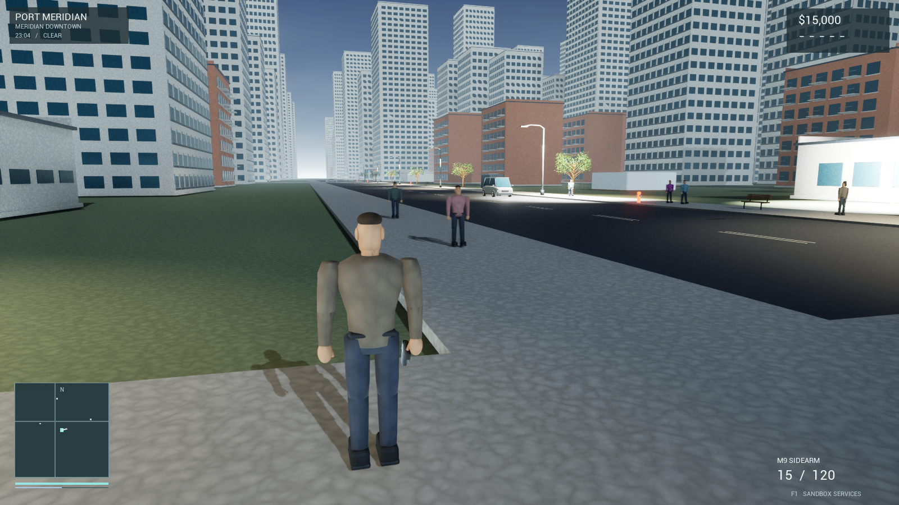
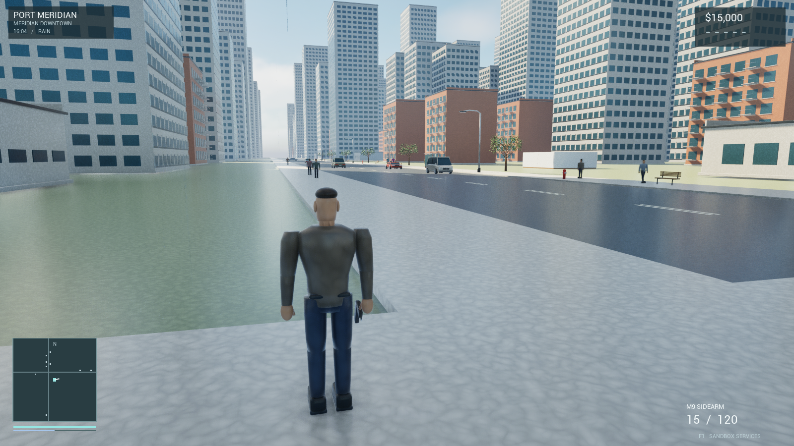
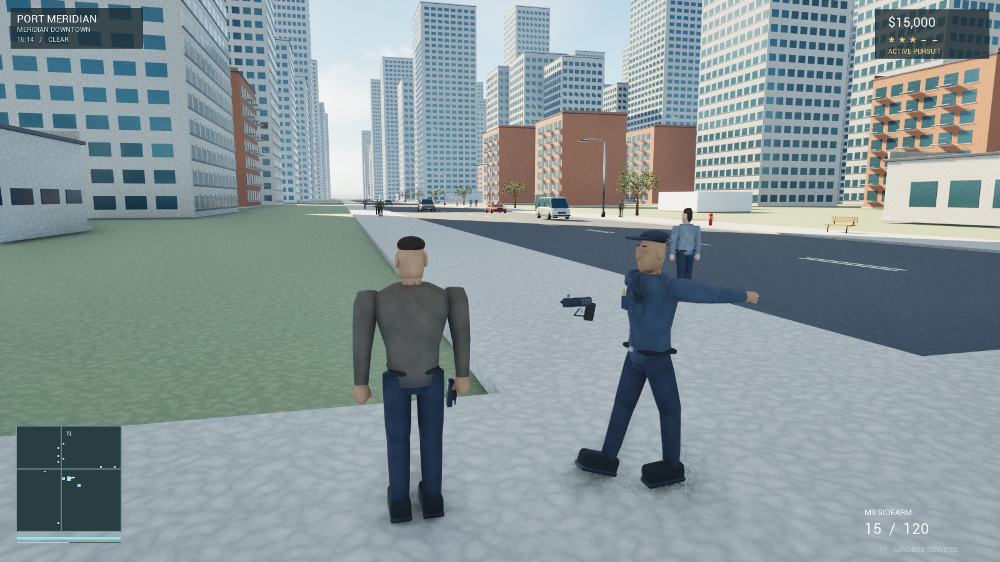
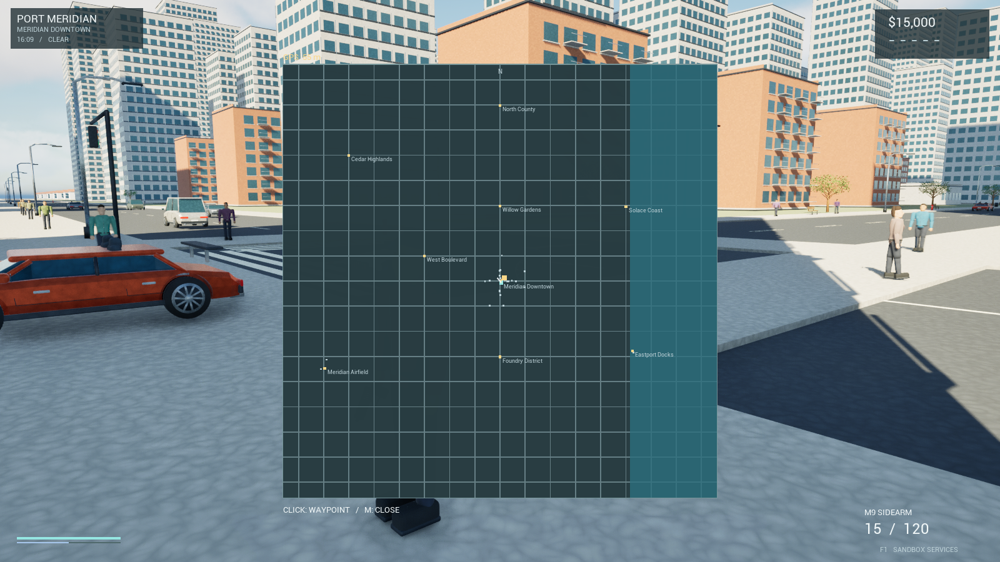
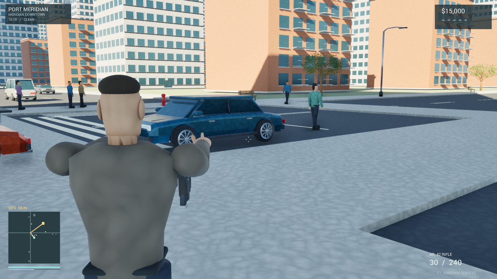

# Port Meridian — validation evidence

## Builds

- Unreal_GTAEditor Win64 Development: succeeded.
- Unreal_GTA Win64 Development: succeeded.
- Windows cook/stage/pak/archive: succeeded. Final cook reports zero errors and zero warnings.

## Runtime smoke checks

Check | Editor game | Packaged Windows
--- | --- | ---
ASSETS | PASS  | PASS 
WALK | PASS distance=1232 | PASS distance=1230
VEHICLE_0 | PASS  | PASS 
VEHICLE_1 | PASS  | PASS 
VEHICLE_2 | PASS  | PASS 
VEHICLE_3 | PASS  | PASS 
VEHICLE_4 | PASS  | PASS 
VEHICLE_5 | PASS  | PASS 
VEHICLE_6 | PASS  | PASS 
VEHICLE_7 | PASS  | PASS 
VEHICLE_8 | PASS  | PASS 
VEHICLE_9 | PASS  | PASS 
VEHICLE_10 | PASS  | PASS 
VEHICLE_11 | PASS  | PASS 
VEHICLE_12 | PASS  | PASS 
ENTER | PASS  | PASS 
DRIVE | PASS distance=11409 speed=3419 | PASS distance=11409 speed=3420
EXIT | PASS  | PASS 
HITSCAN | PASS health=75.0 | PASS health=75.0
DAMAGE | PASS  | PASS 
SAVE | PASS  | PASS 
POLICE | PASS officers=3 vehicles=4 air=1 | PASS officers=3 vehicles=4 air=1
UMG | PASS buttons=25 | PASS buttons=25
HELICOPTER | PASS travel=31969 climb=8369 | PASS travel=31970 climb=8369
BOAT | PASS travel=14125 z=9 | PASS travel=14125 z=9
SWIM | PASS breath=94.2 | PASS breath=94.2
PARACHUTE | PASS vz=-332 | PASS vz=-332
ESCAPE | PASS wanted=0 | PASS wanted=0
SHOP | PASS cash=1500 | PASS cash=1500
GARAGE | PASS  | PASS 
AIRPLANE | PASS travel=44022 climb=8583 | PASS travel=43905 climb=8565

Both runs reached PM_SMOKE_COMPLETE. Tests use actual Enhanced Input for walking/aircraft/boat, real collision traces for shooting, and saved UAssets/cooked content. Vehicle_0..12 checks only confirm mesh load; they are not separate driving tests for every vehicle. UMG validates widget construction, not every mouse interaction. ESCAPE advances search timers after removing police; it is a controlled state test, not a timed pursuit benchmark. Later changes concerned visual materials, HUD readability, spawn/port positions, labels, procedural aim poses and camera ignoring NPC capsules; the last two were checked in a separate packaged UI/equipment capture.

## Rendered capture windows

Automated hidden-window run, 1600x900, r.ScreenPercentage=100, quality level 2, 90 FPS cap; standalone Development build.
AMD Ryzen 7 5700X3D / NVIDIA GeForce RTX 5070

Scene | Mean frame ms | P95 frame ms | Mean loop FPS | Frames | NPC / vehicles
--- | ---: | ---: | ---: | ---: | ---:
01_Downtown.png | 11.11 | 11.11 | 90.0 | 631 | 37 / 23
02_Services.png | 11.11 | 11.11 | 90.0 | 630 | 40 / 28
03_Airfield.png | 11.14 | 11.11 | 89.8 | 629 | 0 / 7
04_Eastport.png | 11.11 | 11.11 | 90.0 | 630 | 0 / 4
05_Night.png | 11.12 | 11.11 | 89.9 | 630 | 19 / 13
06_Rain.png | 11.11 | 11.11 | 90.0 | 630 | 40 / 26
07_Pursuit.png | 11.12 | 11.11 | 90.0 | 630 | 42 / 28
08_Map.png | 11.11 | 11.11 | 90.0 | 630 | 35 / 25
09_Equipment.png | 11.11 | 11.11 | 90.0 | 630 | 40 / 28

Window-state inspection returned Visible=false. These are short instrumented game-loop windows in an automated hidden-window process, including effects of the 90 FPS cap; hidden-window rendering may skip work, so these figures must NOT be presented as interactive rendering FPS. They are not GPU-only timings, a long play session, a 1%-low benchmark or a guarantee for other machines. Teleport streaming may produce brief hitches outside the sampling window. Audio files loaded; no subjective listening test was performed.

## Visual evidence

Screenshots are actual rendered game frames from the packaged executable; no image-generation tool or retouching was used.

## Logs

Local detailed logs: .astra-run/build.log, package-final-verified.log, package-release.log, runtime-final.log, packaged-test.log and packaged-visual-final.log. They are left on disk, but excluded from Git. Compact machine-readable evidence is committed in .astra-run/qa_results.json.

